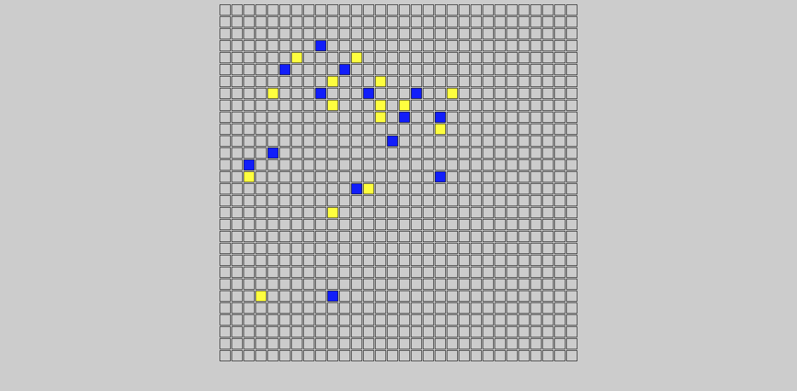
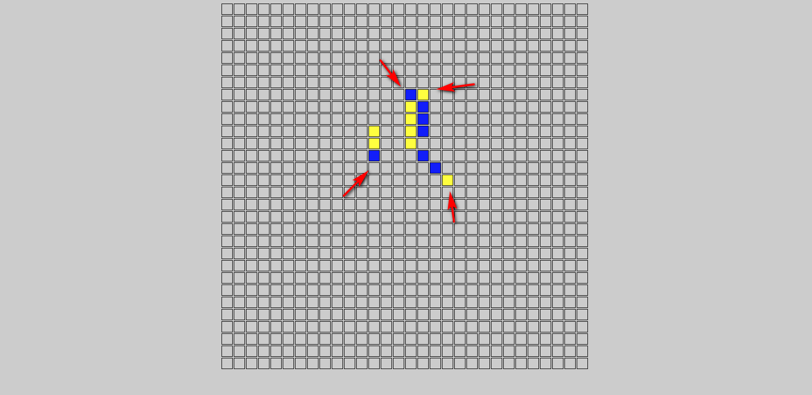
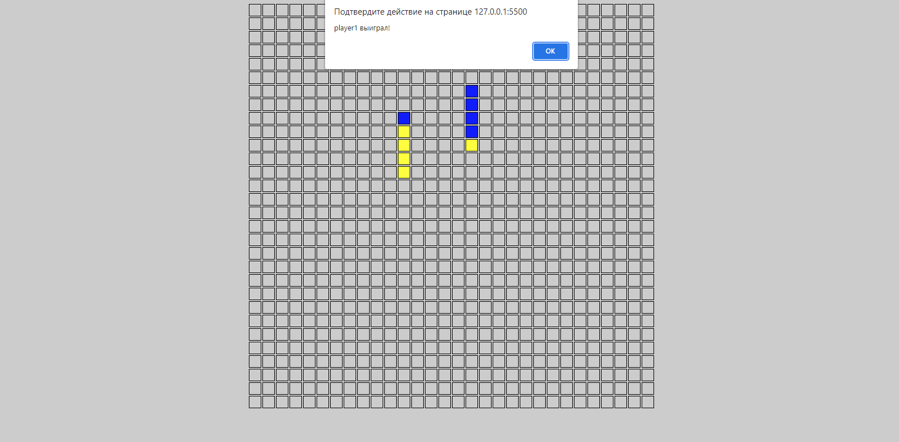

<h1 align="center">Игра 5 точек</h1>

 

## Описание
 
#### Смысл игры состоит в том, чтобы выставить в любом ряду или диагонали пять точек подряд раньше другого игрока

 

---

<h2 align="center"><a  href="https://guryanov-junior.github.io/5-points/">Live Demo</a></h2>

---

 

## Правила

- #### В игре учавствуют 2 игрока. У каждого из них свой цвет отметок

- #### Игроки ходят по очереди и могут мешать друг другу, ставя свои точки после точек другого игрока

 

 

- #### Выигрывает тот игрок, который первым поставит 5 отметок своего цвета подряд

 

 

## Технологии в проекте

#### Игра написана на чистом JavaScript
